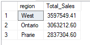
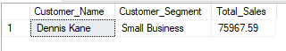
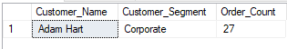

# 📊 Kultra-Mega-Stores-Sales-Analysis
## Introduction
This project presents an end-to-end SQL-based analysis of Kultra Mega Stores (KMS) order data from 2009 to 2012. As a Business Intelligence Analyst supporting KMS’s Abuja division, my objective was to extract, clean, and analyze the dataset to uncover trends, performance gaps, and business opportunities. The analysis provides actionable insights to inform management decisions on sales strategy, customer engagement, and operational efficiency. Using SQL Server, I performed data cleaning, transformation, aggregation, and reporting tasks.
## 📝 Company Overview
Kultra Mega Stores (KMS), headquartered in Lagos, Nigeria, specializes in the sale of office supplies and furniture. The company’s customer base includes:
- Individual consumers
- Small businesses (retail)
- Large corporate clients (wholesale)

KMS operates primarily in Lagos, with business operations extending to regions such as Abuja. The company is committed to delivering high-quality products and services to support both small and large office environments.
## 🚀 Project Objective
The goal of this project was to:
 - Analyze historical order data to identify sales trends and patterns.
 - Evaluate customer segments and product performance.
 - Review shipping costs in relation to delivery methods and order priorities.
 - Provide recommendations to optimize revenue, cost efficiency, and customer satisfaction.
## 📂 Dataset Used
- **Source:** The Business Manager of KMS provided me with an Excel file containing KMS order records from 2009 to 2012.
- **Main tables used:**
 - KMS_Orders: Sales transactions, shipping, customer, and product data.
 - Order_Status: Order return information.
## 🛠 Tools Used
- SQL Server
- SQL Server Management Studio (SSMS)
## 📌 Analysis Approach
The following steps were followed in the analysis:
- **Database setup**: Created `KMS_Inventory` database and structured `KMS_Orders` table with appropriate primary key and data types.
- **Data cleaning**: Updated numeric columns (e.g., Sales, Profit, Discount) to correct decimal formats for consistency and accuracy.
- **Exploratory queries**: Developed SQL queries to answer key business questions and solve case scenarios 
## 🎯 Case Scenarios and Key Insights
### Case Scenario I: Sales and Shipping Performance
**1. 💰 Which product Category had the highest sales?**

*The highest product category by sales was **Technology**. This provides a focus for future promotions.*

**2. 📍 What are the Top 3 and Bottom 3 regions in terms of sales?**

**Top 3**

**Bottom 3**

*The top 3 regions in terms of sales had strong business presence and they contributed the majority of sales while the bottom 3 regions in terms of sales had weaker business presence and they present growth opportunities for the company.*

**3. 🏠 What were the total sales of appliances in Ontario?**

*Appliances sales in **Ontario** were isolated to assess regional product strength.*

**4. 📈 Advice KMS on increasing revenue from Bottom 10 customers**
 - Analysis shows that these 10 customers have the least revenue, mainly buying low-value products and placing infrequent orders.
 - Based on these results, I recommend that KMS introduces upselling strategies focused on these customers to grow their revenue.
 - The strategies could include:
   - conducting a survey to identify their needs in order to provide satisfaction.
   - giving out targeted promotions or bonuses.
   - providing free delivery for orders above a certain amount.

**5. 🚚 Which shipping method incurred the most cost for KMS?**

*Delivery truck had the highest total shipping cost*

### Case Scenario  II: Customer Insights
**6. 👑 Who are the most Valuable customers and what do they purchase?**

*The most valuable customers are the top customers and they majorly purchased technology products and office equipments.*

**7. 💼 Which small business customer had the highest sales?**

**8. 🏢 Which corporate customer placed the most orders between 2009 and 2012?**

**9. 🛒 Which consumer customer was the most profitable?**

**10. 🔄 Which customer returned items and what segment do they belong to?**

*A total of 419 orders were returned, with returns spread across all customer segments.*

**11. ⚖️ Was shipping cost appropriately aligned with order priority?**

**🔍 Observation**
- Delivery truck which is expected to be the slowest and most economical is incurring the highest average shipping cost (around 43-47), and is used across all the order priorities including the critical and high.
- Express air which is expected to be the fastest and most expensive has a lower average shipping cost (around 6-8), and is used across all order priorities including low and unspecified.

**✅ In conclusion, from the analysis above, KMS is not apppopriately aligning shipping cost effectively with both ship modes and order priority.**
## 💡 Key Recommendations
**1. 🚀 Revenue optimization:**
 - Focus upselling efforts on low-revenue customers with targeted promotions, surveys, and personalized offers.
 - Expand market penetration strategies in bottom-performing regions (Yukon, Nunavut).

**2. 🚚 Operational cost control:**
 - Review shipping policies to align shipping modes with order priority — avoid high-cost delivery trucks for low-priority or low-value orders.
 - Reassess shipping contracts or processes to ensure delivery truck remains economical, or transition to cost-effective alternatives.

**3. 👥 Customer targeting:**
 - Prioritize high-value customers with loyalty programs and tailored product recommendations.
 - Strengthen engagement with small businesses and corporate clients who drive significant orders.

**4. 📝 Returns management:**
 - Investigate reasons for returns across segments to reduce return rates and associated costs.
## 📂 File Structure
KMS-Sales-Analysis/

├── [README.md](README.md) 

├── [KMS_Inventory.sql](KMS_Inventory.sql) 

├── [KMS_Order.csv](KMS_Order.csv)

└── [Order_Status.csv](Order_Status.csv) 

## 🎬 Final Words
This analysis provided key insights into KMS’s sales, customer segments, and shipping operations. It highlights opportunities to grow revenue, cut shipping costs, and improve customer targeting. Acting on these findings can help KMS boost profitability and streamline operations.

*Authored By*: **Canaan Olanipekun**

*Date*: **June 2025**
